# GJS Company Profile Web
This project is a company profile web application developed and enhanced to transform a previously static website into a dynamic and scalable system.

The system introduces a CMS (Content Management System) that allows non-technical administrators to manage website content through an admin panel. Additionally, a Career Portal was implemented to streamline the recruitment process with automated workflows.

## Disclaimer
* This project is confidential and developed for a company/client.
* The source code is private and cannot be shared publicly due to confidentiality and ownership agreements.
* This repository is intended for portfolio purposes only.
  
## Key Improvements
* Converted frontend from Vue.js to React.js to improve maintainability and scalability
* Transformed static website into a dynamic CMS-based system
* Developed admin panel for content management
* Implemented Career Portal system for recruitment workflow
* Integrated Google reCAPTCHA v3 for improved security
* Secure API Communication with Payload Encryption/Decryption
* Seamless navigation using Inertia.js.

## Preview

### Career Page
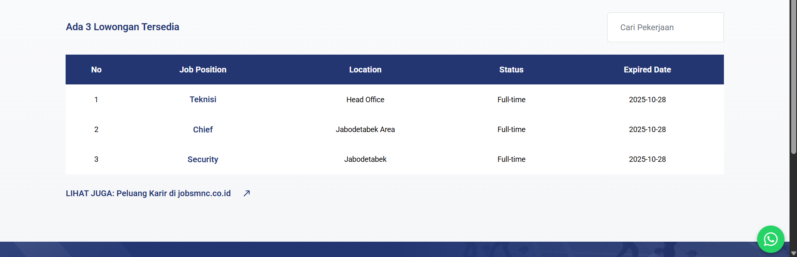

### Job Application Page
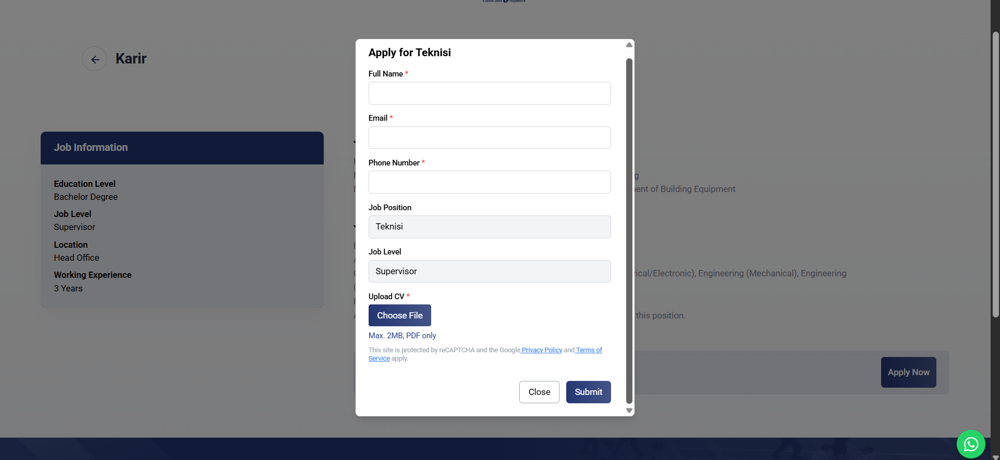

---

### 🔐 Admin Panel

#### Login Page
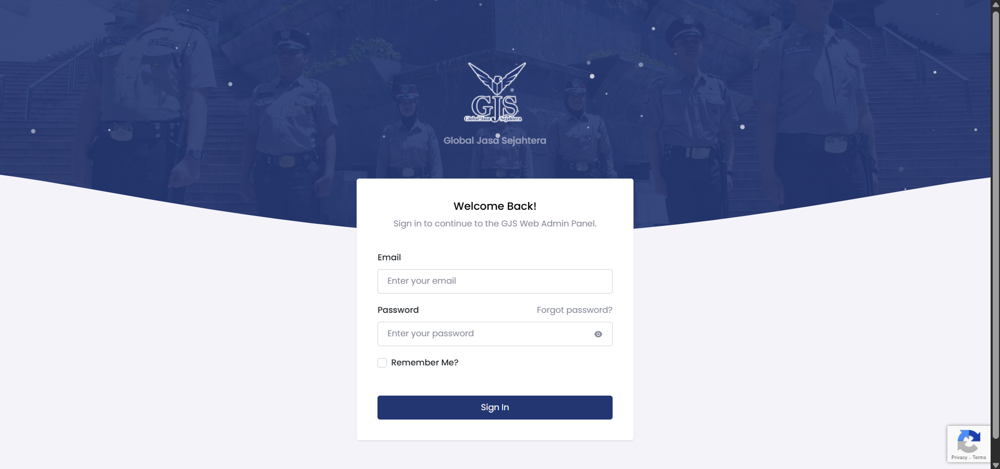

#### Dashboard
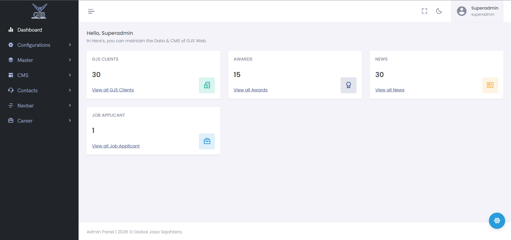

#### Roles Management
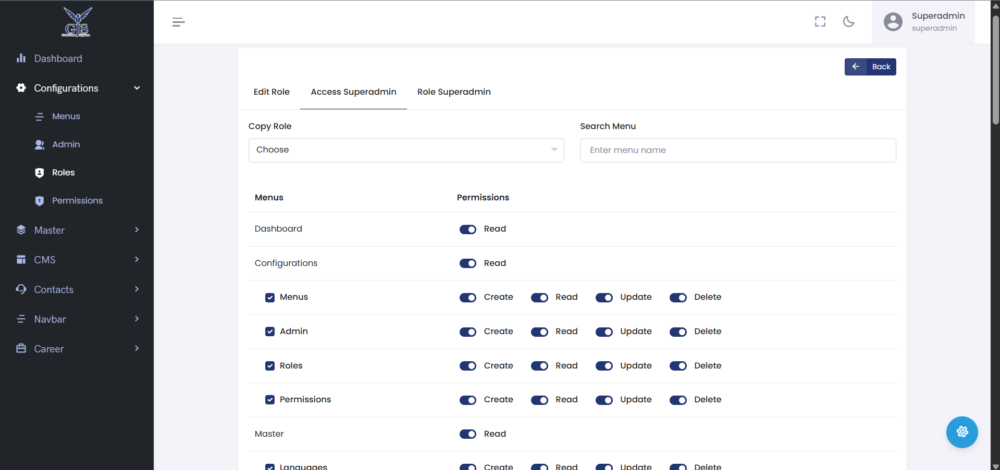

#### Master Data
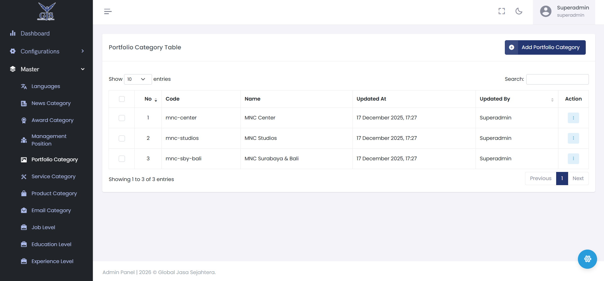

#### CMS Data Management
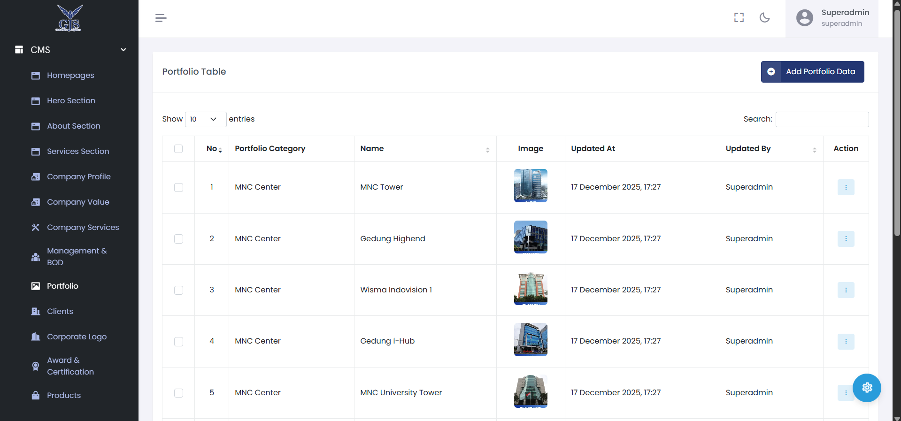

#### Contact Data Management
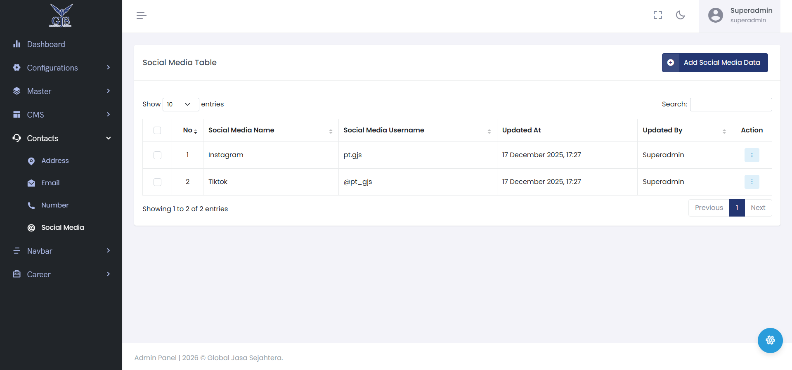

#### Navigation Management
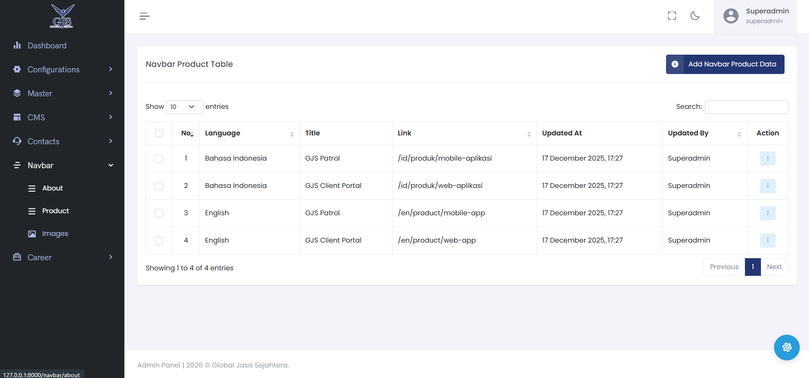

#### Job Applicant Data
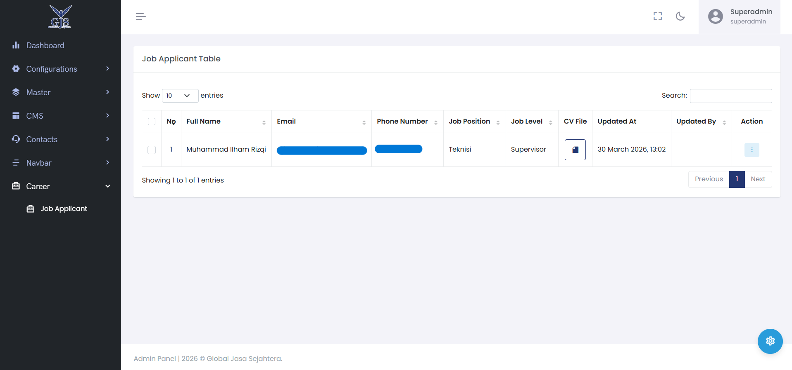

---

### 🔔 Job Applicant Notification System

#### Admin Side Notification
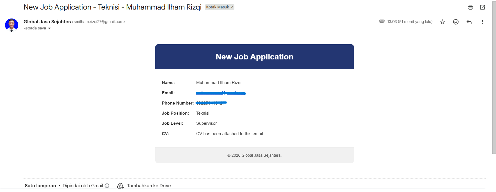

#### User Side Notification
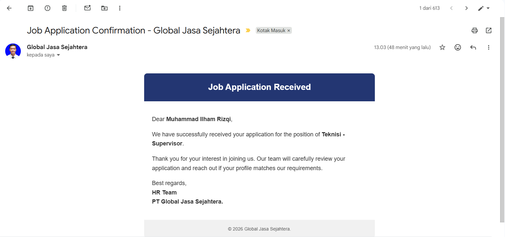

## Tech Stack
* Backend: Laravel 11 (PHP 8.2)
* Authentication : Laravel Sanctum (Stateful/Token-based)
* Frontend: React.js (Vite), Tailwind CSS
* Database: PostgreSQL
* Architecture: Hybrid (Inertia.js for Routing + RESTful API for Data)

## My Responsibilities
* Migrated frontend architecture from Vue.js to React.js
* Identified and fixed bugs across multiple features to ensure system stability and better user experience
* Developed backend system using Laravel framework
* Designed and implemented CMS for dynamic content management
* Built admin panel to allow non-technical users to manage website content
* Developed Career Portal with:
> _**Automated email notifications (SMTP triggers) and Centralized candidate data management**_
* Integrated frontend and backend system
* Improved website performance, scalability, and maintainability
